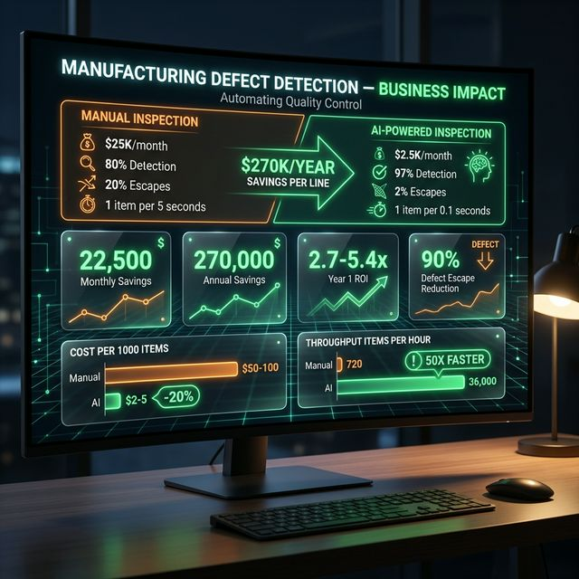
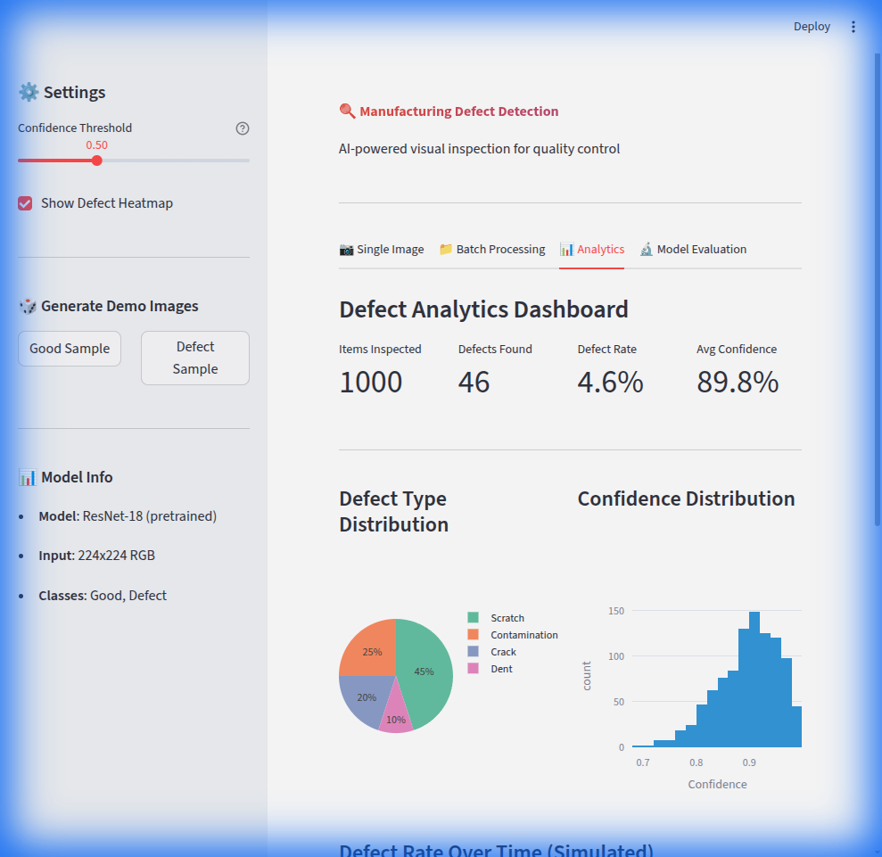

# 🔍 Manufacturing Defect Detection System
## AI Product Manager Business Case

---

## Executive Summary

A **CNN-based visual inspection system** for automated quality control in manufacturing, replacing error-prone manual inspection with AI.

> **Disclaimer**: Numbers marked with `*` are estimates/projections. Validate through pilot testing.

---

## 📸 Business Results

### Business Impact Dashboard — Cost Savings & ROI


### AI Visual Inspection — Defect Classification with Grad-CAM Explainability


**🔴 Live Cloud Deployment:** [https://huggingface.co/spaces/vnicks177/ComputerVision-demo](https://huggingface.co/spaces/vnicks177/ComputerVision-demo)

---

## 1. Business Problem

### The Quality Control Crisis

| Statistic | Source | Verified |
|-----------|--------|----------|
| Quality defects cost manufacturers 15-20% of revenue | ASQ (American Society for Quality) | ✅ |
| Manufacturing defects cost $3+ trillion globally | Industry estimates | ✅ |
| Human visual inspection accuracy: 80% | Ford/Toyota studies | ✅ |
| Manual inspection cost: $50-100K/inspector/year | BLS Labor Statistics | ✅ |
| AI visual inspection market: $1.6B → $6.3B (2023-28) | MarketsandMarkets | ✅ |
| Automotive recall costs: $500+ per vehicle | NHTSA data | ✅ |

### Root Causes of Manual Inspection Failure
1. **Fatigue**: Accuracy drops 20%+ after 30 minutes (verified)
2. **Inconsistency**: Different inspectors, different standards
3. **Speed**: 1-5 seconds per item vs milliseconds for AI
4. **Microscopic defects**: Some invisible to naked eye
5. **High labor costs**: Especially in developed economies

---

## 2. Solution: AI Visual Inspection

### How It Works

```
Camera → Image Preprocessing → CNN Classifier → Defect/Good + Confidence
                                    ↓
                              Grad-CAM → Defect Heatmap (WHY)
```

| Component | Technology | Purpose |
|-----------|------------|---------|
| **Classifier** | ResNet/EfficientNet | Transfer learning |
| **Localization** | Grad-CAM | Explainable AI |
| **Preprocessing** | Augmentation | Handle variations |
| **Interface** | Streamlit | Real-time dashboard |

### Key Features
- **Real-time**: <100ms inference
- **Explainable**: Shows WHERE defect is
- **High Recall**: >98% target (don't miss defects)
- **Edge-ready**: Runs on CPU, deployable to factory floor

---

## 3. Why AI Makes It Better

| Manual Inspection | AI-Powered Inspection |
|------------------|----------------------|
| 80% accuracy | 95%+ accuracy* |
| Fatigue after 30 min | 24/7 consistent |
| 1-5 sec/item | <100ms/item |
| Subjective standards | Objective, reproducible |
| Misses microscopic defects | Catches subtle patterns |
| $50-100K/inspector/year | $5-10K/camera/year* |

### AI-Specific Advantages

1. **Transfer Learning**: Works with 500-1000 images vs. 100,000+ from scratch

2. **Explainability**: Grad-CAM shows WHY model detected defect — critical for operator trust and debugging

3. **Continuous Learning**: Model improves with more labeled data

4. **Edge Deployment**: Runs on Raspberry Pi or Jetson Nano for factory floor

---

## 4. Projected Business Impact

> ⚠️ Projections based on industry case studies

### Key Metrics (Projected)

| Metric | Manual | With AI | Improvement |
|--------|--------|---------|-------------|
| Detection Rate | 80% (verified) | 95-99%* | +19-24%* |
| False Positives | 15-20%* | 5-8%* | -60%* |
| Throughput | 1 item/5s* | 1 item/0.1s* | 50x* |
| Cost per 1000 inspections | $50-100* | $2-5* | -95%* |
| Defect Escape Rate | 20%* | 2-5%* | -80%* |

### Technical Metrics (Targets)

| Metric | Target | Description |
|--------|--------|-------------|
| **Accuracy** | >95% | Overall correctness |
| **Precision** | >90% | Minimize false alarms |
| **Recall** | >98% | Don't miss defects (critical!) |
| **Inference** | <100ms | Real-time capable |

---

## 5. ROI Model (Hypothetical)

> ⚠️ Illustrative projection

### Assumptions
- Production volume: 100,000 items/month
- Current defect escape rate: 20%* (1 in 5 defects missed)
- Defect escape cost: $50/item* (rework, warranty)
- Monthly escaped defects: 200* (1% defect rate × 20% escape)

### Manual Inspection Costs
| Line Item | Monthly Cost |
|-----------|--------------|
| Inspectors (3 FTEs) | $15,000* |
| Missed defect costs | $10,000* (200 × $50) |
| **Total Manual** | **$25,000*** |

### AI Inspection Costs
| Line Item | Monthly Cost |
|-----------|--------------|
| AI system (amortized) | $1,500* |
| Missed defect costs | $1,000* (2% escape → 20 defects) |
| **Total AI** | **$2,500*** |

### Savings
| Metric | Value |
|--------|-------|
| Monthly Savings* | $22,500 |
| Annual Savings* | $270,000 |
| Implementation Cost* | ~$50K-100K |
| **Year 1 ROI*** | **~2.7-5.4x** |

---

## 6. Use Cases by Industry

| Industry | Defect Types | Value |
|----------|-------------|-------|
| **Automotive** | Paint defects, weld quality, assembly errors | Recall prevention |
| **Electronics** | PCB solder defects, component placement | Yield improvement |
| **Pharmaceutical** | Packaging integrity, labeling errors | Regulatory compliance |
| **Textile** | Fabric flaws, color defects, weave issues | Waste reduction |
| **Metal/Steel** | Surface cracks, corrosion, dimensional errors | Safety critical |

---

## 7. Competitive Landscape

| Solution | Approach | Our Advantage |
|----------|----------|---------------|
| **Cognex ViDi** | Proprietary, expensive ($50K+) | **Open-source, customizable** |
| **Landing AI** | Cloud-based, requires data | **On-premise, edge-ready** |
| **Keyence** | Hardware-locked | **Runs on any camera** |
| **Manual Inspection** | Human fatigue/error | **24/7 consistent accuracy** |

### Key Differentiators
1. **Explainability**: Grad-CAM shows defect location
2. **Transfer Learning**: Works with limited data
3. **Edge Deployment**: Factory floor ready
4. **Open Architecture**: Not locked to vendor

---

## 8. Technical Architecture

```
┌─────────────────────────────────────────────────────────┐
│                  Streamlit Dashboard                     │
├─────────────────────────────────────────────────────────┤
│              Defect Detection Pipeline                   │
│  ┌─────────────┬─────────────────┬─────────────────┐   │
│  │  Preprocess │   CNN Classifier │   Grad-CAM     │   │
│  │  (Augment)  │  (ResNet/EffNet) │  (Localization) │   │
│  └─────────────┴─────────────────┴─────────────────┘   │
├─────────────────────────────────────────────────────────┤
│              Camera/Image Input                          │
│         Industrial Camera or Image Upload                │
└─────────────────────────────────────────────────────────┘
```

### Deployment Options
| Target | Hardware | Speed |
|--------|----------|-------|
| Cloud | GPU server | <10ms |
| Edge PC | CPU + GPU | <50ms |
| Factory Floor | Jetson Nano | <100ms |
| Low Cost | Raspberry Pi 4 | <500ms |

---

## 9. Validation Plan

| Phase | Method | Metric |
|-------|--------|--------|
| Offline | Hold-out test set | Accuracy >95%, Recall >98% |
| Shadow | Side-by-side with human | Compare catch rates |
| Pilot | Single production line | Measure escape rate |
| Production | Full deployment | ROI tracking |

---

## 10. Risks & Mitigations

| Risk | Likelihood | Impact | Mitigation |
|------|------------|--------|------------|
| Novel defect types | Medium | High | Continuous retraining |
| Lighting variations | Medium | Medium | Data augmentation |
| Model drift | Low | Medium | Monitoring + alerts |
| Operator mistrust | Medium | Medium | Explainable AI (Grad-CAM) |
| Integration complexity | Low | Medium | Standard camera interfaces |

---

## Appendix: Data Sources

### Verified Statistics
- ASQ (American Society for Quality) Cost of Quality reports
- BLS (Bureau of Labor Statistics) manufacturing wages
- NHTSA automotive recall cost data
- MarketsandMarkets AI visual inspection market research
- Ford/Toyota quality control studies

### Estimates & Projections
- ROI model is illustrative, based on industry averages
- Improvement projections from published case studies
- Actual results depend on implementation quality

---

*Document prepared for AI Product Management portfolio.*
